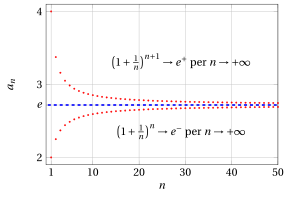
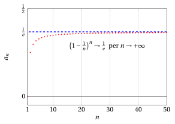
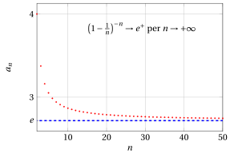
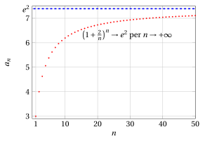

# Il numero di Nepero

**Parte 3 · Limiti di successioni · Capitolo 3** · dalle dispense di Fabio Furini · [:material-file-pdf-box: PDF del capitolo](../pdf/successioni-03-nepero.pdf)

## 1. Il numero $e$ di Nepero

!!! teorema "Teorema 1"

    La successione

    $$
    a_n = \left( 1 + \frac{1}{n}\right)^n {\rm ~~~con~~~} n \ge 1
    $$

    è convergente.

??? dimostrazione "Dimostrazione"

    Proveremo che  la successione $\{a_n\}$ è  monotona crescente ($a_n \ge a_{n-1}, \forall n \in \N, n\ge 2$) e limitata ($m \le a_n \le M, \forall n \in \N, n \ge 1$); quindi è convergente per il teorema di monotonia delle successioni.

    Per provare che $\{a_n\}$ è  monotona crescente, studiamo per $n \ge 2$, il rapporto:

    \begin{align*}
    \frac{a_n}{a_{n-1}} & = \frac{\left(1 + \frac{1}{n}\right)^n}{\left(1 + \frac{1}{n-1}\right)^{n-1}} = \frac{\left( \frac{n+1}{n} \right)^n}{\left( \frac{n}{n-1} \right)^{n-1}}\\[2ex] 
    & = \left( \frac{\frac{n+1}{n} }{\frac{n}{n-1} } \right)^n \: \frac{1}{\left( \frac{n}{n-1}\right)^{-1}} =  \left( \frac{n^2-1}{n^2}  \right)^n \: \frac{1}{\left( \frac{n-1}{n}\right)}\\[2ex]
    & = \frac{\left( 1 - \frac{1}{n^2}\right)^n}{1 - \frac{1}{n}} \ge \frac{1 - n \cdot \frac{1}{n^2}}{1 - \frac{1}{n}} = 1
    \end{align*}

    dove per il “$\ge$”  si è applicata la disuguaglianza di Bernoulli:

    $$
    (1 + x)^n \ge 1 + n \: x {\rm ~~con~~} x= -\frac{1}{n^2} \ge -1 {\rm ~~e~~} n \ge 2
    $$

    Quindi abbiamo

    $$
    \frac{a_n}{a_{n-1}} \ge 1
    $$

    ossia $a_{n} \ge a_{n-1}$ e la successione è monotona crescente. 

    Per provare che $\{a_n\}$ è  limitata,  osserviamo che,  essendo $a_1 = 2$, segue $a_n \ge 2, \forall n \ge 1$. 

    Consideriamo ora la successione

    $$
    b_n = \left( 1 + \frac{1}{n}\right)^{n+1} {\rm~~si~noti~che~~} b_n = a_n \: \left( 1 + \frac{1}{n}\right) 
    {\rm ~~perciò~~} b_n > a_n, \forall n \in \N, n \ge 1
    $$

    
□

??? dimostrazione "Dimostrazione"

    Per provare che $\{b_n\}$ è  monotona decrescente, studiamo per $n \ge 2$, il rapporto:

    \begin{align*}
    \frac{b_n}{b_{n-1}} & 
    = \frac{\left(1 + \frac{1}{n}\right)^{n+1}}{\left(1 + \frac{1}{n-1}\right)^{n}} 
    = \frac{\left( \frac{n+1}{n} \right)^{n+1}}{\left( \frac{n}{n-1} \right)^{n}}\\[2ex] 
    & 
    = \left( \frac{\frac{n+1}{n} }{\frac{n}{n-1} } \right)^{n} \: {\left( \frac{n+1}{n}\right)} 
    = \frac{1}{\left( \frac{n^2}{n^2-1}  \right)^{n}} \: {\left( \frac{n+1}{n}\right)}\\[2ex]
    &
    =\frac{1}{\left( 1 + \frac{1}{n^2 -1}  \right)^{n}} \: {\left( \frac{n+1}{n}\right)}\le 
    \frac{1}{\left( 1 + \frac{n}{n^2 -1}  \right)} \: {\left( \frac{n+1}{n}\right)}\\[2ex]
    &
    <
    \frac{1}{\left( 1 + \frac{1}{n}  \right)} \: \left( 1 + \frac{1}{n}  \right)=1
    \end{align*}

    dove per il “$\le$”  si è applicata la disuguaglianza di Bernoulli:

    $$
    (1 + x)^{n} \ge 1 + n \: x {\rm ~~con~~} x= \frac{1}{n^2-1} \ge -1 {\rm ~~e~~} n \ge 2
    $$

    e per il “$<$” si è applicata la disuguaglianza

    $$
    \frac n{n^2-1}>\frac 1n {\rm ~~~~dato~che ~~~~} n^2 > n^2 -1 {\rm ~~per~~} n \ge 2
    $$

    Quindi abbiamo dimostrato che

    $$
    \frac{b_n}{b_{n-1}} < 1 {\rm ~~quindi~~ } b_n < b_{n-1}
    $$

    e la successione $\{b_n\}$ è monotona (strettamente) decrescente.

    Poiché $b_1=4$, risulta quindi

    $$
    a_n < b_n \le b_1  =4, ~\forall n \ge 1
    $$

    e $\{a_n\}$ è limitata. □

!!! esempio "Esempio 1: Grafici delle successioni $\{a_n\}$ e $\{b_n\}$"

    { .fig .ovale loading=lazy style="width:85%" }

- Il limite della successione $a_n$ appena studiata è un numero <strong>irrazionale</strong> molto importante in matematica. Questo limite viene indicato con la lettera $e$ (<strong>numero di Nepero</strong>) e la sua rappresentazione decimale inizia così:

    $$
    2. 7182818284 \dots
    $$

    !!! chiave ""

        Per definizione, abbiamo:

        \begin{equation}
        e= \lim_{n \rr \ip } \left( 1 + \frac{1}{n}\right)^n \label{nepero}
        \end{equation}

- Questo numero viene molto spesso usato come base dei logaritmi, i quali, quando si usa questa base, vengono detti naturali o neperiani (dal nome del matematico <strong>John Napier</strong>) e indicati semplicemente col simbolo $\log$ (oppure $\ln$) senza indicazione della base.

- Abbiamo di conseguenza:

    \begin{equation*}
    \lim_{n \rr \ip } n \: \log \left( 1 + \frac{1}{n}\right)  = \lim_{n \rr \ip }  \log \left( 1 + \frac{1}{n}\right)^n  = \log e =1
    \end{equation*}

!!! esempio "Esempio 2: Calcolo dei limiti con la successione che tende a $e$"

    \begin{align*}
    \lim_{n \rr \ip }  \left( 1 - \frac{1}{n}\right)^n = \frac{1}{e}
    \end{align*}

    Dato che:

    $$
    \left( \frac{n-1}{n}\right)^n = \frac{1}{\left( \frac{n}{n-1}\right)^n} = \frac{1}{\left( 1+ \frac{1}{n-1}\right)^n} = \frac{1}{\underbrace{\left( 1+ \frac{1}{n-1}\right)^{n-1}}_{\rr e}} \cdot \frac{1}{\underbrace{\left( 1+ \frac{1}{n-1}\right)}_{\rr 1}}
    $$

    { .fig .ovale loading=lazy style="width:85%" }

!!! teorema "Teorema 2"

    Sia $\{c_n\}$ una qualsiasi successione divergente (a $\ip$ o $\im$), allora

    \begin{equation}
    \lim_{n \rr \ip } \left( 1 + \frac{1}{c_n}\right)^{c_n} = e, \qquad  \lim_{n \rr \ip } \left( 1 - \frac{1}{c_n}\right)^{c_n} = \frac{1}{e}  \label{nepero_tris}
    \end{equation}

??? dimostrazione "Dimostrazione"

    Ricordiamo che, dato $x \in \R$, la sua parte intera, denotata con $\lfloor x \rfloor$, è il più grande intero che non supera $x$.

    Se $c_n \rr \ip$, poiché $\lfloor c_n \rfloor > c_n -1$, per confronto si ha anche $\lfloor c_n \rfloor \rr \ip$. Quindi, per la \(\eqref{nepero}\) e per la definizione di limite abbiamo

    $$
    \lim_{n \rr \ip } \left( 1 + \frac{1}{\lfloor c_n \rfloor + 1}\right)^{\lfloor c_n \rfloor + 1} = \lim_{n \rr \ip } \left( 1 + \frac{1}{\lfloor c_n \rfloor }\right)^{\lfloor c_n \rfloor } = e
    $$

    Usando:

    $$
    \lfloor c_n \rfloor \le c_n < \lfloor c_n \rfloor + 1
    $$

    si ottiene

    $$
    \left( 1 + \frac{1}{ c_n  }\right)^{ c_n  } < \left( 1 + \frac{1}{\lfloor c_n \rfloor }\right)^{\lfloor c_n \rfloor + 1} = \underbrace{\left( 1 + \frac{1}{\lfloor c_n \rfloor }\right)^{\lfloor c_n \rfloor }}_{\rr e} \cdot \underbrace{\left( 1 + \frac{1}{ \lfloor c_n \rfloor  }\right)}_{\rr 1}
    $$

    e anche

    $$
    \left( 1 + \frac{1}{ c_n  }\right)^{ c_n  } > \left( 1 + \frac{1}{\lfloor c_n \rfloor +1 }\right)^{\lfloor c_n \rfloor } = \underbrace{\left( 1 + \frac{1}{\lfloor c_n \rfloor +1}\right)^{\lfloor c_n \rfloor +1}}_{\rr e} \cdot \underbrace{\left( 1 + \frac{1}{ \lfloor c_n +1\rfloor  }\right)^{-1}}_{\rr 1}
    $$

    quindi il primo limite del teorema segue dal teorema del confronto.

    Se invece $c_n \rr \im$, allora la successione $d_n = -c_n \rr \ip$, e si ha

    $$
    \left( 1 + \frac{1}{ c_n  }\right)^{ c_n  } = \left( 1 - \frac{1}{ d_n  }\right)^{ -d_n  } =  \left( \frac{d_n}{d_n-1}\right)^{ d_n  } =  \left( 1 + \frac{1}{d_n-1}\right)^{ d_n  -1} \cdot \left( 1 + \frac{1}{d_n-1}\right)
    $$

    Poiché $d_n-1 \rr \ip$, la tesi segue dal caso precedente.

    Il secondo limite del teorema si dimostra in maniera analoga. □

!!! chiave ""

    Questo teorema è  utile nel calcolo di limiti che coinvolgono la forma di indecisione $1^{\infty}$

!!! esempio "Esempio 3: Calcolo dei limiti con la successione che tende a $e$"

    Calcoliamo

    $$
    \lim_{n \rr \ip} \left( \frac{n}{3 +n}\right)^{5 \: n+1} = [1^{\infty}]
    $$

    dato che:

    $$
    \lim_{n \rr \ip} \frac{n}{3+n} = \lim_{n \rr \ip} 1 - \frac{3}{3+n} = 1, \qquad\lim_{n \rr \ip} 5\:n +1 =\ip
    $$

    Riscriviamo la successione come segue:

    \begin{align*}
    \left( \frac{n}{3 +n}\right)^{5 \: n +1} &= \left( \frac{3 +n}{n}\right)^{-(5 \: n +1)} = \frac{1}{\left(1 + \frac{3}{n}  \right)^{5 \: n +1}} \\[2ex]
     &= \frac{1}{\left( \left( 1 + \frac{3}{n} \right)^{\frac{n}{3}} \right)^{\frac{3\:(5\:n+1)}{n}}} = \frac{1}{\left( \left( 1 + \frac{1}{\frac{n}{3}} \right)^{\frac{n}{3}} \right)^{\frac{3\:(5\:n+1)}{n}}}
    \end{align*}

    e consideriamo il denominatore

    $$
    \left( \underbrace{\left( 1 + \frac{1}{\frac{n}{3}} \right)^{\frac{n}{3}} }_{\rr e}\right)^{\overbrace{\frac{3\:(5\:n+1)}{n}}^{\rr 15}}
    \rr e^{15}
    \qquad{\rm ~~~dato~che~~~} 
     \frac{n}{3} \rr \ip  {\rm ~per~} n \rr \ip
    $$

    Riassumendo quindi abbiamo:

    $$
    \lim_{n \rr \ip} \left( \frac{n}{3 +n}\right)^{5 \: n+1} = \frac{1}{e^{15}}
    $$

    <u>Metodo alternativo</u>:

    $$
    \lim_{n \rr \ip} \left( \frac{n}{3 +n}\right)^{5 \: n+1} = \lim_{n \rr \ip} \left( 1- \frac{3}{3 +n}\right)^{5 \: n +1} = \lim_{n \rr \ip} \left( \underbrace{\left( 1- \frac{1}{\frac{3 +n}{3}}\right)^{\frac{3+n}{3}}}_{\rr \frac{1}{e}} \right)^{ \overbrace{\frac{3\:(5\:n+1)}{3+n}}^{\rr 15}} = \frac{1}{e^{15}}
    $$

    dato che

    $$
    \frac{3+n}{3} \rr \ip {\rm ~per~} n \rr \ip
    $$

!!! esempio "Esempio 4: Calcolo dei limiti con la successione che tende a $e$"

    \begin{align*}
    \lim_{n \rr \ip }  \left( 1 - \frac{1}{n}\right)^{-n} = e
    \end{align*}

    Dato che:

    $$
    \left( \frac{n-1}{n}\right)^{-n} = \left( \frac{n}{n-1}\right)^{n} = \left( 1+ \frac{1}{n-1}\right)^{n} = \underbrace{\left( 1+ \frac{1}{n-1}\right)^{n-1}}_{\rr e} \cdot \underbrace{\left( 1+ \frac{1}{n-1}\right)}_{\rr 1}
    $$

    { .fig .ovale loading=lazy style="width:85%" }

!!! esempio "Esempio 5: Calcolo dei limiti con la successione che tende a $e$"

    \begin{align*}
    \lim_{n \rr \ip }  \left( 1 + \frac{\alpha}{n}\right)^n = e^\alpha {\rm ~~~con~~~} \alpha \in \R
    \end{align*}

    Dato che:

    $$
    \left( 1 + \frac{\alpha}{n}\right)^n = \left( 
    1 + \frac{1}{\frac{n}{\alpha}}\right)^n = \left( \underbrace{\left( 1 + \frac{1}{\frac{n}{\alpha}}\right)^{\frac{n}{\alpha}}}_{\rr e} \right)^\alpha
    $$

    Ad esempio con $\alpha=2$ abbiamo:

    \begin{align*}
    \lim_{n \rr \ip }  \left( 1 + \frac{2}{n}\right)^n = e^2
    \end{align*}

    { .fig .ovale loading=lazy style="width:85%" }

<strong>Prova tu</strong> — il grafico interattivo qui sotto ti fa vedere quello che hai appena letto: muovi i cursori.

## 2. Il numero di Nepero in finanza

- Supponiamo di possedere un capitale di valore unitario e un tasso d'interesse annuale $t$. Se l'interesse viene pagato annualmente, dopo un anno il capitale posseduto sarà

    $$
    1 + t \cdot 1 = 1 + t
    $$

- Se invece l'interesse viene pagato mensilmente avremo

    - dopo il primo mese, un capitale pari a

        $$
        1+ \frac{t}{12} \cdot 1= \underbrace{1 + \frac{t}{12}}_{\alpha}
        $$

    - dopo il secondo mese, un capitale pari a

        $$
        \underbrace{1 + \frac{t}{12}}_{\alpha} + \frac{t}{12} \underbrace{\left( 1 + \frac{t}{12} \right)}_{\alpha} = \underbrace{\left(1 + \frac{t}{12}\right)^2}_{\beta}
        $$

    - dopo il terzo mese, un capitale pari a

        $$
        \underbrace{\left(1 + \frac{t}{12}\right)^2}_{\beta} + \frac{t}{12} \: \underbrace{\left(1 + \frac{t}{12}\right)^2}_{\beta} = \left(1 + \frac{t}{12}\right)^3
        $$

    - alla fine dell'anno avremo un capitale pari a

        $$
        \left(1 + \frac{t}{12}\right)^{12}
        $$

- Se l'interesse viene calcolato ogni $n$-esimo di anno, avremo alla fine un capitale pari a

    $$
    \left(1 + \frac{t}{n}\right)^{n}
    $$

- Per $t = 1$ (rendita del 100%) otteniamo esattamente la successione che definisce $e$

    !!! chiave ""

        Quindi anche se gli interessi vengono pagati un numero infinito di volte all'anno, il capitale non cresce all'infinito ma tende a $e$, dato che:

        $$
        \lim_{n \rr \ip } \left( 1 + \frac{1}{n}\right)^n= e
        $$
