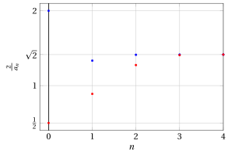
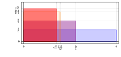

# Successioni definite per ricorrenza

**Parte 3 · Limiti di successioni · Capitolo 6** · dalle dispense di Fabio Furini · [:material-file-pdf-box: Dispensa del volume (PDF)](../pdf/dispensa-3-limiti.pdf)

## 1. Successioni definite per ricorrenza

- Cominciamo con il seguente problema:

    !!! chiave ""

        La banca ci presta $a_0$ euro, con una spesa di gestione di $b$ euro l'anno, al tasso di interesse fisso $r$ annuo ($r \in (0,1)$). Quanto dovremo restituire dopo $n$ anni?

- Dopo un anno, la cifra da restituire sarà

    $$
    a_1 = a_0 + r \; a_0 + b = \left(1+ r\right) a_0 +b
    $$

    dopo due anni

    $$
    a_2 = a_1  + r \; a_1 + b = \left(1+ r\right) a_1 +b
    $$

    dopo tre anni

    $$
    a_3 = a_2  + r \; a_2 + b = \left(1+ r\right) a_2 +b
    $$

    e così via… Ogni anno la cifra viene calcolata utilizzando la cifra dell'anno precedente. Abbiamo quindi  la successione:

    $$
    \underbrace{a_0 {\rm ~~~assegnato}}_{{\rm valore~assegnato}}, \qquad \underbrace{a_{n+1} = \left(1+ r\right) \; a_n + b}_{{\rm relazione~ricorsiva}} {\rm ~~con~~} n \in \N
    $$

    Questo è un caso molto semplice di <strong>successione definita per ricorrenza</strong>, in cui ogni termine è definito a partire dal precedente (o dai precedenti).

- In questo caso è facile convincersi che la successione possa essere riscritta in <strong>forma chiusa</strong> (cioè esplicita). 

    Dopo un anno:

    $$
    a_1  = \left(1+ r\right) \; a_0 + b
    $$

    dopo due anni:

    \begin{align*}
    a_2 &= \left(1+ r\right) \; a_1 + b = \left(1+ r\right) \: \big(\left(1+ r\right) \; a_0 + b \big) + b\\[2ex] 
    &= \left(1+ r\right)^2 \; a_0 + b \; \big(1+ \left(1+ r\right) \big)
    \end{align*}

    dopo tre anni:

    \begin{align*}
    a_3 &= \left(1+ r\right) \; a_2 + b = \left(1+ r\right) \: \bigg(\left(1+ r\right)^2 \; a_0 + b \;\big(1+ \left(1+ r\right) \big)\bigg) + b \\[2ex]
    &= \left(1+ r\right)^3 \; a_0 + b \;\big(1+ \left(1+ r\right) + \left(1+ r\right)^2 \big)
    \end{align*}

    e così via … quindi

    $$
    a_n = s^n \: a_0 + b \: \big(1 + s + s^2 + \dots +s^{n-1}\big), {\rm ~~dove~~} s = \left(1+ r\right)>1
    $$

    Possiamo quindi calcolarci facilmente il limite come segue:

    $$
    \lim_{n \rr \ip} a_n = \lim_{n \rr \ip} s^n \: a_0 + b \: \big(1 + s + s^2 + \dots +s^{n-1}\big) = \ip
    $$

    !!! chiave ""

        Tuttavia, non è sempre possibile esplicitare una successione data in forma iterativa. In tal caso, resta il <strong>problema di capirne il comportamento e il limite</strong>.

!!! esempio "Esempio 1: Comportamento di una successione definita per ricorrenza"

    Fissato $b > 0$, determiniamo il comportamento della successione definita da

    $$
    a_0 =b, \qquad  a_{n+1} = \frac{a_n}{1+a_n} {\rm ~~con~~} n \in \N
    $$

    Tutti i termini della successione sono positivi, quindi il denominatore della frazione che compare nella definizione non si annulla mai.

    Per verificarlo si procede per induzione:

    $$
    a_0 = b > 0, {\rm ~~e~se~~} a_n > 0 {\rm ~~allora~~} 
     a_{n+1} = \frac{a_n}{1+a_n} > 0 {\rm ~~~~(quoziente~di~due~numeri~positivi)}
    $$

    Di conseguenza tutti i termini della successione, dopo quello di partenza, sono minori di $1$, visto che $a_n < 1 + a_n$.

    Ad esempio con $b=5$, abbiamo:

    $$
    a_0=5,~~~a_1=\frac{5}{6},~~~a_2=\frac{\frac{5}{6}}{1+\frac{5}{6}}=\frac{5}{11},~~~a_3=\frac{\frac{5}{11}}{1+\frac{5}{11}}=\frac{5}{16} \dots
    $$

    { .fig .ovale loading=lazy style="width:65%" }

!!! esempio "Esempio 2: Comportamento di una successione definita per ricorrenza"

    Cerchiamo di capire se la successione sia o meno monotona. Sappiamo che $a_n >0, \forall n \in \N$, allora la disuguaglianza $a_n \le a_{n +1}$ diventa

    $$
    a_n \le a_{n +1}  \Longleftrightarrow a_n \le \frac{a_n}{1+a_n} \Longleftrightarrow 1+ a_n \le 1 \Longleftrightarrow a_n \le 0
    $$

    che sappiamo essere falsa; quindi vale la disuguaglianza opposta, ovvero la successione è strettamente decrescente ($a_n > a_{n +1}, \forall n \in \N$).

    Essendo anche limitata inferiormente (da zero), $a_n$ converge a un limite finito non negativo che chiamiamo  $\ell \ge 0$.

    Passiamo al limite nella relazione ricorsiva.

    $$
    \underbrace{\lim_{n \rr \ip } a_{n+1}}_{= \ell} = \underbrace{\lim_{n \rr \ip } \frac{a_n}{1+a_n} }_{= \frac{\ell}{1+\ell}} {\rm ~~~~quindi~~~~~} \ell = \frac{\ell}{1+\ell} {\rm ~~~~e~di~conseguenza~~~~} \ell = 0
    $$

    dato che

    $$
    \ell - \frac{\ell}{1+\ell} =0,\qquad \frac{\ell (1+\ell) - \ell}{1+\ell}=0,\qquad \frac{\ell^2}{1+\ell}=0 ~~~\Longleftrightarrow~~~ \ell =0
    $$

!!! esempio "Esempio 3: Formula chiusa della ricorrenza"

    Fissato $b > 0$, cerchiamo la formula chiusa della successione:

    $$
    a_0 =b, \qquad  a_{n+1} = \frac{a_n}{1+a_n} {\rm ~~per~~} n \in \N
    $$

    Con $n=1$, abbiamo

    $$
    a_1  = \frac{a_0}{1+a_0}
    $$

    Con $n=2$, abbiamo

    $$
    a_2  = \frac{a_1}{1+a_1} = \frac{\frac{a_0}{1+a_0}}{1+\frac{a_0}{1+a_0}} = \frac{\frac{a_0}{1+a_0}}{\frac{1+2\:a_0}{1+a_0}} = \frac{a_0}{1+a_0} \; \frac{1+a_0}{1+2\:a_0} = \frac{a_0}{1+2\;a_0}
    $$

    Con $n=3$, abbiamo

    \begin{align*}
    a_3  &= \frac{a_2}{1+a_2} = \frac{\frac{a_0}{1+2\;a_0}}{1+\frac{a_0}{1+2\;a_0}} = \frac{\frac{a_0}{1+2\;a_0}}{\frac{1+3\;a_0}{1+2\;a_0}}= \frac{a_0}{1+2\;a_0} \; \frac{1+2\;a_0}{1+3\;a_0} =  \frac{a_0}{1+3\;a_0}
    \end{align*}

    e così via … quindi

    $$
    a_n = \frac{a_0}{1+n \; a_0} {\rm ~~con~~} n \in \N {\rm ~~~~~~e~abbiamo~~} \lim_{n \rr \ip } \frac{a_0}{1+n \; a_0} = 0
    $$

!!! chiave ""

    Il precedente esempio illustra una buona strategia in due passi per studiare il comportamento di successioni definite per ricorrenza:

    1. si cerca di capire se la successione soddisfi qualche proprietà di monotonia;

    2. in tal caso si esaminano i possibili limiti, tenendo conto della relazione ricorsiva.

## 2. L'algoritmo di Erone

- Fissati $b > 0$ e $c >0$, studiamo la seguente successione definita per ricorrenza:

    $$
    a_0 =b, \qquad  a_{n+1} = \frac{1}{2} \left( a_n + \frac{c}{a_n} \right) {\rm ~~con~~} n \in \N
    $$

    È evidente che la successione è  costituita da numeri positivi. Per verificarlo si procede per induzione:

    $$
    a_0 = b > 0, {\rm ~~e~se~~} a_n > 0 {\rm ~~allora~~} 
     a_{n+1} = \frac{1}{2} \left( a_n + \frac{c}{a_n} \right)= \frac{1}{2} \left(  \frac{a_n^2 + c}{a_n} \right) > 0
    $$

    dato che abbiamo il quoziente di due numeri positivi.

    Cerchiamo di capire se la successione sia o meno monotona. Sappiamo che $a_n >0, \forall n \in \N$, la disuguaglianza $a_{n +1} < a_{n}$ diventa

    $$
    a_{n +1} < a_{n} \Longleftrightarrow \frac{1}{2} \left( a_n + \frac{c}{a_n} \right) < a_n \Longleftrightarrow   c < a_n^2 \Longleftrightarrow a_n > \sqrt{c}
    $$

    dato che

    $$
    \frac{1}{2} \left( a_n + \frac{c}{a_n} \right) < a_n, ~~~~~~  \frac{a_n^2 + c}{a_n}  < 2\:a_n, ~~~~~~ a_n^2 + c < 2\: a_n^2 , ~~~~~~   c < a_n^2
    $$

    quindi la successione è strettamente decrescente se e solo se:

    $$
    a_n > \sqrt{c}
    $$

    Si tratta ora di capire se questa condizione sia o meno vera. Si ha

    $$
    a_{n +1} = \frac{1}{2} \left( a_n + \frac{c}{a_n} \right) > \sqrt{c}  \Longleftrightarrow \left( a_n - \sqrt{c}\right)^2 >0 \Longleftrightarrow a_n \neq \sqrt{c}
    $$

    dato che

    $$
    \frac{1}{2} \left( a_n + \frac{c}{a_n} \right) -  \sqrt{c} > 0,~~~~~  \frac{a_n^2 + c}{2\:a_n} - \sqrt{c} > 0,~~~~~ \frac{a_n^2 + c - 2\: a_n\:\sqrt{c}}{2\:a_n}  > 0,~~~~~ \frac{(a_n - \sqrt{c})^2}{2\:a_n}  > 0
    $$

    quindi $a_n > \sqrt{c}$ per ogni $n \ge 1$ se $\underbrace{ b }_{= a_0} \neq \sqrt{c}$.  E quindi abbiamo sempre  $a_1 > \sqrt{c},  \forall b >0$. 

    1. Se $b >\sqrt{c}$ la successione è strettamente decrescente, pertanto ammette limite (finito e positivo) che denotiamo $\ell \ge 0$.

        Per identificarlo, passiamo al limite nella relazione ricorsiva, ottenendo

        $$
        \underbrace{\lim_{n \rr \ip } a_{n+1}}_{= \ell} = \underbrace{\lim_{n \rr \ip }  \frac{1}{2} \left( a_n + \frac{c}{a_n} \right) }_{= \frac{1}{2} \left( \ell + \frac{c}{\ell} \right)} {\rm ~~quindi~~~}  \ell = \frac{1}{2} \left( \ell + \frac{c}{\ell} \right) {\rm ~~e~di~conseguenza~~} \ell = \sqrt{c}
        $$

        dato che

        $$
        \ell - \frac{1}{2} \left( \ell + \frac{c}{\ell} \right) = 0,~~~~~~\ell - \frac{1}{2} \left(   \frac{\ell^2+c}{\ell} \right) = 0,~~~~~~ \left(   \frac{2\: \ell^2 -\ell^2-c}{2\:\ell} \right) = 0,~~~~~~ \left(   \frac{\ell^2 -c}{2\:\ell} \right) = 0
        $$

        Pertanto, se $b >\sqrt{c}$, tutta la successione converge decrescendo a $\sqrt{c}$.

    2. Se invece $0 <b <\sqrt{c}$, allora per quanto visto prima si avrà $a_1 > \sqrt{c}$, e da quel momento la successione comincerà a decrescere, tendendo di nuovo a $\sqrt{c}$.

    3. Infine, se $b = \sqrt{c}$, la successione resta costante, dato che

        $$
        a_1 = \frac{1}{2} \left(\sqrt{c} + \frac{c}{\sqrt{c}} \right) = \frac{1}{2} \frac{\sqrt{c}\sqrt{c}+c}{\sqrt{c}}= \frac{1}{2} \frac{2 c}{\sqrt{c}}=\frac{\sqrt{c}\sqrt{c}}{\sqrt{c}}=\sqrt{c}
        $$

        e  tutti gli altri termini $a_n$, con $n >1$, di conseguenza avranno lo stesso valore $\sqrt{c}$.

- Inoltre $\forall b >0$ e $n \ge 1$ abbiamo:

    $$
    \frac{c}{a_n} < \sqrt{c}  {\rm ~~~~dato~che~~~} a_n > \sqrt{c},  \qquad 
     c = \sqrt{c} \cdot \underbrace{\sqrt{c}}_{<a_n} {\rm ~~~~~e~~~~~} c < \sqrt{c} \cdot a_n
    $$

    Riassumendo, $\forall b >0$ e $n \ge 1$ abbiamo:

    $$
    \frac{c}{a_n} < \sqrt{c} < a_n, \qquad   a_n \rr \sqrt{c}
      {\rm ~~~~~e~anche~~~~} \frac{c}{a_n} \rr \sqrt{c}  {\rm ~~dato ~che~~} c =\sqrt{c} \sqrt{c}
    $$

!!! chiave ""

    Per ogni scelta di $b >0$ la successione $a_n$ tende a $\sqrt{c}$ e può quindi essere usata per  approssimare la radice quadrata.

!!! esempio "Esempio 4: Comportamento della successione"

    Ad esempio con $c=2$ e $b=4 > \sqrt{2}$ (punti rossi) oppure $b=1 < \sqrt{2}$ (punti blu), abbiamo:

    { .fig .ovale loading=lazy style="width:95%" }

    { .fig .ovale loading=lazy style="width:95%" }

!!! chiave ""

    Il calcolo ricorsivo dei valori della successione appena vista prende il nome di <strong>algoritmo</strong> di Erone, inizialmente proposto per calcolare <strong>il lato di un quadrato di area</strong> $c$.

- I passi dell'algoritmo sono:

    1. Fissata la base pari ad $a_0$ (il valore iniziale $b$), costruiamo il rettangolo associato di area $c$. L'altezza varrà $\frac{c}{a_0}$, dato che l'area del rettangolo è fissata uguale a quella del quadrato, ovvero:

        $$
        c = \left( a_0 \cdot \frac{c}{a_0} \right)
        $$

    2. Poiché il lato del quadrato cercato sarà compreso tra $a_0$ e $\frac{c}{a_0}$, si prende come nuova approssimazione $a_1$ la media tra $a_0$ e $\frac{c}{a_0}$:

        $$
        a_1 = \frac{1}{2} \left( a_0 + \frac{c}{a_0}\right)
        $$

        che diventa la nuova base del rettangolo. Successivamente si prende $a_1$ al posto di $a_0$ e si ripete, e così via.

    !!! chiave ""

        Ad esempio cerchiamo di calcolare il lato di un quadrato di area $c=2$, in altre parole cerchiamo di stimare il valore $\sqrt{2}$.

    Alla <strong>prima iterazione</strong> (con n=0) consideriamo ad esempio un rettangolo di base $a_0=b=4$ (la prima <strong>approssimazione</strong> per eccesso  di $\sqrt{2}$), di conseguenza l'altezza è $\frac{c}{a_0}=\frac{1}{2}$ (la prima appr. per difetto  di $\sqrt{2}$). Quindi: $\frac{1}{2} < \sqrt{2} <4$.

    Calcoliamo il valore $a_1$:

    $$
    a_1 = \frac{1}{2} \left( 4 + \frac{1}{2}\right) = \frac{9}{4}
    $$

    Alla <strong>seconda iterazione</strong> (con n=1) abbiamo un rettangolo di base $a_1=\frac{9}{4}$ (la seconda appr. per eccesso  di $\sqrt{2}$), di conseguenza l'altezza è $\frac{c}{a_1}=\frac{2}{9/4}=\frac{8}{9}$ (la seconda appr. per difetto  di $\sqrt{2}$). Quindi: $\frac{8}{9} < \sqrt{2} <\frac{9}{4}$. 

    Calcoliamo il valore $a_2$:

    $$
    a_2 = \frac{1}{2} \left( \frac{9}{4} + \frac{8}{9}\right) = \frac{113}{72}
    $$

    Alla <strong>terza iterazione</strong> (con n=2) abbiamo un rettangolo di base $a_2=\frac{113}{72}$ (la terza appr. per eccesso di $\sqrt{2}$), di conseguenza l'altezza è $\frac{c}{a_2}=\frac{2}{113/72}=\frac{144}{113}$ (la terza appr. per difetto  di $\sqrt{2}$). Quindi: $\frac{144}{113} < \sqrt{2} <\frac{113}{72}$. 

    { .fig .ovale loading=lazy style="width:90%" }

    Calcoliamo il valore $a_3$:

    $$
    a_3 = \frac{1}{2} \left( \frac{113}{72} + \frac{144}{113}\right) =  \frac{23,137}{16,272}
    $$

    Alla <strong>quarta iterazione</strong> (con n=3) abbiamo un rettangolo di base $a_3=\frac{23,137}{16,272}$ (la quarta appr. per eccesso di $\sqrt{2}$), di conseguenza l'altezza è $\frac{c}{a_3}=\frac{2}{23,137/16,272}=\frac{32,544}{23,137}$ (la quarta appr. per difetto  di $\sqrt{2}$). Quindi: $\frac{32,544}{23,137} < \sqrt{2} <\frac{23,137}{16,272}$. 

    Già alla quarta iterazione abbiamo una stima abbastanza buona di $\sqrt{2}$:

    $$
    \frac{23137}{16272} = \red{1.4}21890363\dots {\rm ~~~~e~~~} \sqrt{2}=1.414213562\dots
    $$

    ovvero una stima corretta fino alla prima cifra decimale. 

    Calcoliamo infine il valore $a_4$:

    $$
    a_4 = \frac{1}{2} \left(\frac{23,137}{16,272} + \frac{32,544}{23,137}\right) =  \frac{1,064,876,737}{752,970,528}
    $$

    Con la nuova stima abbiamo:

    $$
    \frac{1,064,876,737}{752,970,528} = \red{1.4142}34285\dots {\rm ~~~~e~~~} \sqrt{2}=1.414213562\dots
    $$

    che è corretta fino alla quarta cifra decimale, ovvero con una sola iterazione aggiuntiva abbiamo sistemato 3 ulteriori cifre decimali.

### 2.1 Stima degli errori dell'algoritmo di Erone

- L'<strong>errore relativo</strong> $\tilde{\varepsilon}_n$  all'iterazione $n$ è:

    $$
    \tilde{\varepsilon}_n = \frac{|a_n - \sqrt{c}|}{\sqrt{c}}
    $$

    abbiamo $\sqrt{c} < a_n, \forall b >0$ e $n \ge 1$, quindi possiamo semplicemente considerare:

    $$
    \tilde{\varepsilon}_n = \frac{a_n - \sqrt{c}}{\sqrt{c}}
    $$

    !!! chiave ""

        Il valore di $\sqrt{c}$ è ignoto quindi ci serve un modo per analizzare i valori degli errori relativi che sia indipendente da $\sqrt{c}$.

    Consideriamo prima l'<strong>errore assoluto</strong>:

    $$
    \varepsilon_n = a_n - \sqrt{c}
    $$

    sappiamo che

    $$
    \frac{c}{a_n} < \sqrt{c} < a_n,~~~~ \forall b >0, n \ge 1
    $$

    quindi possiamo ottenere una stima dell'errore assoluto $\varepsilon_n$ commesso all'iterazione $n$ come segue:

    $$
    \varepsilon_n = a_n - \sqrt{c} < a_n - \frac{c}{a_n} {\rm ~~~~e~~~~} \varepsilon_n \rr 0 {\rm ~~per~~} n \rr \ip {\rm ~~dato~che~~} a_n \rr \sqrt{c}
    $$

    

    !!! esempio "Esempio 5: Stima degli errori dell'algoritmo di Erone ($\sqrt{2}=1.414213562\dots$)"

        Riprendiamo l'esempio precedente con $c=2$ e $b=4$,  abbiamo:

        
<table>
        <tr>
        <td>iter.</td>
        <td>\(\frac{2}{a_n}\)</td>
        <td>\(a_n\)</td>
        <td>stima di \(\sqrt{2}\)</td>
        <td>\(\varepsilon_n\)</td>
        </tr>
        <tr>
        <td>\(n=0\)</td>
        <td>\(\frac{1}{2}\)</td>
        <td>\(4\)</td>
        <td>4</td>
        <td>\(<\frac{7}{2}=\)</td>
        <td>3.5</td>
        </tr>
        <tr>
        <td>\(n=1\)</td>
        <td>\(\frac{8}{9}\)</td>
        <td>\(\frac{9}{4}\)</td>
        <td>2.25</td>
        <td>\(<\frac{49}{36}=\)</td>
        <td>1.361…</td>
        </tr>
        <tr>
        <td>\(n=2\)</td>
        <td>\(\frac{144}{113}\)</td>
        <td>\(\frac{113}{72}\)</td>
        <td>1.569444444…</td>
        <td>\(<\frac{2,401}{8,136}=\)</td>
        <td>0.295…</td>
        </tr>
        <tr>
        <td>\(n=3\)</td>
        <td>\(\frac{32,544}{23,137}\)</td>
        <td>\(\frac{23,137}{16,272}\)</td>
        <td>1.421890363…</td>
        <td>\(< \frac{5,764,801}{376,485,264}\)=</td>
        <td>0.0153…</td>
        </tr>
        <tr>
        <td>\(n=4\)</td>
        <td>\(\frac{1,505,941,056}{1,064,876,737}\)</td>
        <td>\(\frac{1,064,876,737}{752,970,528}\)</td>
        <td>1.414234285…</td>
        <td>\(< \frac{33,232,930,569,601}{801,820,798,913,807,136}\)</td>
        <td>0.000041…</td>
        </tr>
        </table>

    

    !!! esempio "Esempio 6: Errori e Intervalli considerati dall'algoritmo di Erone"

        { .fig .ovale loading=lazy style="width:85%" }

        { .fig .ovale loading=lazy style="width:85%" }

    !!! chiave ""

        Vogliamo ora capire con che “velocità” decresca l'errore comparando gli errori relativi di due iterazioni consecutive.  Questa stima ci fornisce delle informazioni sulla qualità dell'algoritmo, ovvero vogliamo determinare la  <strong>“velocità di convergenza”</strong> dell'algoritmo.

    Cominciamo osservando che il valore $\sqrt{c}$ si può scrivere nel seguente modo:

    $$
    \sqrt{c} = \frac{1}{2} \left(\sqrt{c} + \frac{c}{\sqrt{c}} \right) {\rm ~~dato~che~~}  \frac{1}{2} \left(\sqrt{c} + \frac{c}{\sqrt{c}} \right) = \frac{1}{2} \frac{\sqrt{c}\sqrt{c}+c}{\sqrt{c}}= \frac{1}{2} \frac{2 c}{\sqrt{c}}=\frac{\sqrt{c}\sqrt{c}}{\sqrt{c}}=\sqrt{c}
    $$

    Stabiliamo ora il legame tra $\varepsilon_{n+1}$ e $\varepsilon_{n}$, abbiamo:

    \begin{align*}
    \varepsilon_{n+1} & = a_{n+1} - \sqrt{c} = \frac{1}{2} \left( a_n + \frac{c}{a_n} \right) - \frac{1}{2} \left(\sqrt{c} + \frac{c}{\sqrt{c}} \right) \\[2ex]
    & = \frac{1}{2} \left( {a_n - \sqrt{c}} +\frac{c}{a_n} - \frac{c}{\sqrt{c}} \right) = \frac{1}{2} \left( \varepsilon_n +\frac{c}{a_n} - \frac{c}{\sqrt{c}} \right) \\[2ex]
    & = \frac{1}{2} \left( \varepsilon_n + \frac{c \: \left(\sqrt{c}  - a_n\right)}{\sqrt{c} \; a_n }\right) =   \frac{1}{2} \left( \varepsilon_n - \frac{c \: \varepsilon_n}{\sqrt{c} \; a_n }\right) =   \frac{1}{2} \left( \varepsilon_n - \frac{\sqrt{c} \: \varepsilon_n}{ \; a_n }\right)\\[2ex]
    &= \frac{1}{2} \: \varepsilon_n  \; \left( 1 - \frac{\sqrt{c}}{ \; a_n }\right)=  \frac{1}{2} \: \varepsilon_n  \; \left(  \frac{a_n-\sqrt{c}}{ \; a_n }\right) \\[2ex]
    &=  \frac{1}{2} \: \frac{\varepsilon_n^2}{a_n}
    \end{align*}

    Cerchiamo ora il legame tra $\tilde{\varepsilon}_{n+1}$ e $\tilde{\varepsilon}_{n}$ e sostituiamo $\varepsilon_n = \sqrt{c} \; \tilde{\varepsilon}_n$ nella formula precedente:

    $$
    \sqrt{c} \; \tilde{\varepsilon}_{n+1} = \frac{1}{2} \: \frac{\left(\sqrt{c} \; \tilde{\varepsilon}_n\right)^2}{a_n} =\frac{1}{2} \: \frac{\sqrt{c}\; \sqrt{c} \; \tilde{\varepsilon}^2_n}{a_n} {\rm ~~~quindi~~~} \tilde{\varepsilon}_{n+1} =\frac{1}{2} \: \frac{ \sqrt{c} \; \tilde{\varepsilon}^2_n}{a_n}
    $$

    Abbiamo:

    $$
    \tilde{\varepsilon}_n = \frac{\varepsilon_n}{\sqrt{c}} = \frac{a_n - \sqrt{c}}{\sqrt{c}}= \frac{a_n}{\sqrt{c}} -1 {\rm ~~~~quindi~~~~} \frac{\sqrt{c}}{a_n}= \frac{1}{\tilde{\varepsilon}_n+1}
    $$

    e quindi otteniamo:

    $$
    \tilde{\varepsilon}_{n+1} = \frac{1}{2} \: \frac{\sqrt{c} \; \tilde{\varepsilon}_n^2}{a_n}   = \frac{1}{2} \;  \frac{\tilde{\varepsilon}_n^2}{1+\tilde{\varepsilon}_n}
    $$

    !!! chiave ""

        Abbiamo ottenuto il legame tra $\tilde{\varepsilon}_{n+1}$ e $\tilde{\varepsilon}_{n}$,  indipendente sia da  $a_n$ che da  $\sqrt{c}$.

    Dalla formula appena ottenuta possiamo dedurne la seguente,  semplificata e più intuitiva:

    $$
    0 \le \tilde{\varepsilon}_{n+1} < \frac{1}{2} \min \big\{\tilde{\varepsilon}_n,\tilde{\varepsilon}_n^2 \big\}
    $$

    Quindi:

    $$
    {\rm ~~se~~~} \tilde{\varepsilon}_n < 1, {\rm ~~~si~ha~~~} \tilde{\varepsilon}_{n+1} < \frac{1}{2} \: \tilde{\varepsilon}_n^2
    $$

    Per esempio, se l'errore relativo a una certa iterazione è pari a $10^{-3}$, al passaggio successivo sarà inferiore a $5 \cdot 10^{-7}$. In altre parole il numero di zeri dopo la virgola (che equivale al numero di cifre, dopo la virgola, correttamente stimate)  raddoppia a ogni iterazione.

    !!! chiave ""

        L'errore relativo dell'algoritmo di Erone ad ogni passo è proporzionale al quadrato dell'errore relativo nel passaggio precedente.  <strong> La velocità di convergenza è quadratica.</strong>

<strong>Prova tu</strong> — il grafico interattivo qui sotto ti fa vedere quello che hai appena letto: muovi i cursori.

